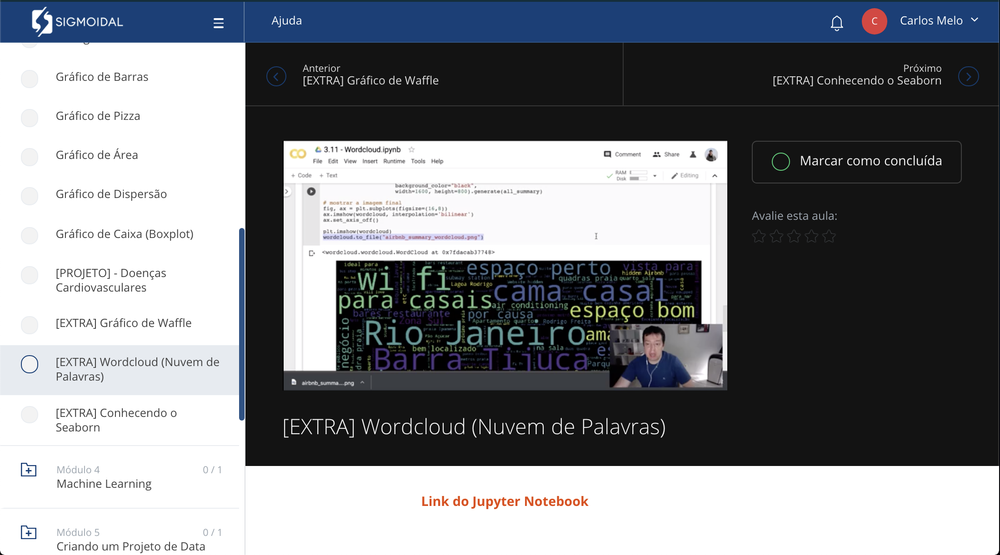

    
    
    

# Data Science na Prática

Material complementar ao treinamento online "Data Science na Prática". Para saber mais informações sobre esse curso, visite os sites:

* Site do curso [Data Science na Prática](https://curso.sigmoidal.ai?utm_source=github)
* Blog [Sigmoidal](https://curso.sigmoidal.ai)

  

## Conteúdo do curso "Data Science na Prática"

* **MÓDULO 1:** [Introdução ao Data Science](https://github.com/carlosfab/curso_data_science_na_pratica/tree/master/modulo_01)
* **MÓDULO 2:**  [Manipulando Dados com o Pandas](https://github.com/carlosfab/curso_data_science_na_pratica/tree/master/modulo_02)
* **MÓDULO 3:** [Visualizando Dados](https://github.com/carlosfab/curso_data_science_na_pratica/tree/master/modulo_03)
* **MÓDULO 4:** Machine Learning *(apenas para alunos)*
* **MÓDULO 5:** Projeto Completo de Data Science *(apenas para alunos)*
* **MÓDULO 6:** Criando um Dashboard *(apenas para alunos)*
* **MÓDULO 7:** Deep Learning *(apenas para alunos)*
---

### Sobre o Instrutor:

Sou Carlos Melo, Piloto Militar da Força Aérea Brasileira e Engenheiro de Missão de Satélite no Centro de Operações Espaciais (COPE), em Brasília-DF. Também sou o autor do *blog* [sigmoidal.ai](http://sigmoidal.ai), focado em Data Science, Deep Learning e Pyhton.

* Graduação em Ciências Aeronáuticas pela AFA.
* Mestrado em Ciências e Tecnologias Espaciais pelo ITA.
* MBA em Gestão de Projetos e Processos pela UNIFA.
* Curso de Operações Espaciais pela Força Aérea Canadense.

